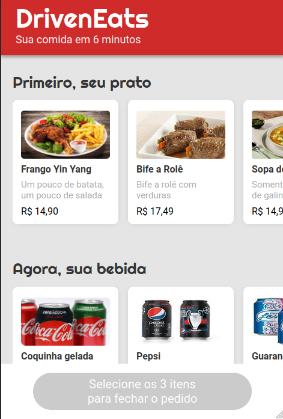
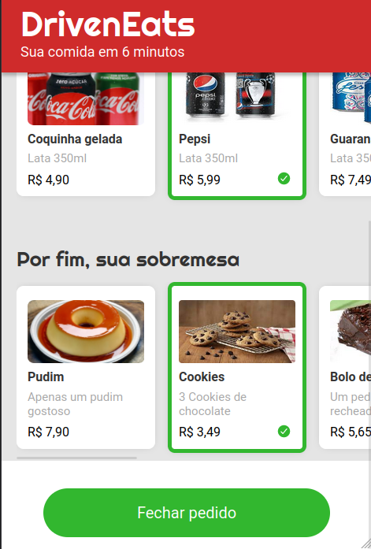
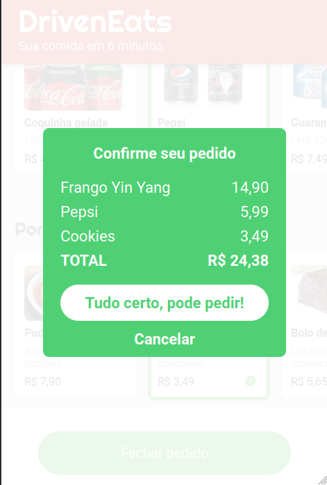

# Driven Eats
## Projeto 03

---
## ✒️ Descrição:

Terceiro projeto do Pimeiro Módulo do curso de Desenvolvimento Full Stack da Driven Education.

Driven Eats é um site de Restaurante que entrega seu pedido em até seis minutos! Para isso, o restaurante só trabalha com um tipo específico de pedido: Prato + Bebida + Sobremesa.

O site permite de forma fácil a escolha do seu combo, enviando em seguida o pedido por whatsapp diretamente para o restaurante.

---
## 🎯 Requisitos:

✅ Fazer o versionamento do código usando o GitHub.  
✅ Recriar o layout fornecido no figma.  
✅ Selecionar somente uma comida por categoria.  
✅ Habilitar botão "Finalizar Pedido" somente quando o combo completo for escolhido.  
✅ Enviar o pedido por WhatsApp.  

---

  <h2>Tecnologias utilizadas:</h2>
  
  
   

---

  

## 📱 Prévia Mobile 📱  

